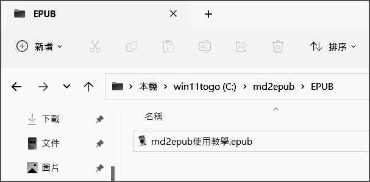

# md2epub 使用教學

在六吋的電子閱讀器上面，看EPUB文件還好，如果是看PDF文件像是在虐待眼睛，但是技術類的文件很少有EPUB格式的，有的也不一定能有很好的顯示效果(買過d3.js的EPUB電子書，結果裡面編排的效果很差)，因此有了自己制作EPUB文件的想法。

md2epub 使用 python (markdown模組) + calibre2，可以把寫好的 markdown 文件轉換為 EPUB 格式的電子書，編排效果依照自己的想法實作出來，能自動生成目錄，可插入圖片等等。


## 2023/02/17 新增 [ 點我下載 md2epub 主程式(免安裝Python-只支援windows作業系統) ](https://github.com/ccutmis/ccutmis.github.io/raw/master/md2epub.zip)
使用說明 : 
1. 把md2epub 整個資料夾解壓縮放至 C:\ 根目錄。
2. 開啟網頁瀏覽器，搜尋'Calibre' 進入 Calibre 官網下載 Calibre 64bit 或從 [這裡直接進到下載頁面](https://calibre-ebook.com/download_windows)
3. 安裝 calibre 時點下方的 Advance ，然後將安裝路徑設為 C:\calibre2 ，接著都按下一步完成安裝即可。
4. 開啟 C:\md2epub 資料夾裡面的 app.exe ，然後按右上角的 "開始轉換", 執行完成之後在 EPUB 資料夾裡面就能看到剛才轉換完成的 .epub 文件檔案，這個文件檔可以傳到你的手機或是電子書閱讀器觀看了!


## CH.1 系統需求

### 1-1 作業系統 : Microsoft Windows 10 以上

### 1-2 安裝 Windows 版 Calibre2 [ https://calibre-ebook.com/zh_TW/download_windows](https://calibre-ebook.com/zh_TW/download_windows)
* 進到 Calibre 的安裝畫面後，點 [ Advanced ] 


* 將安裝路徑設為 C:\Calibre2\


* 然後都按 NEXT 或 INSTALL 即可完成安裝。

### 1-3 安裝 Python 3.7 以上的版本(從Python官網下載安裝程式) 並安裝 markdown 模組 ( pip install markdown )
* 進到 Python 的安裝畫面後，先勾選 [ &#8730; ] Add Python 3.x to Path，然後再按上面的 Install Now，然後都按下一步即可完成安裝。 


* Python 安裝完成後，進入命令提示字元，輸入 pip install markdown [enter] 即可安裝 markdown 模組:


### 1-4 安裝 git 

* 從git官網下載安裝程式，安裝時直接按 Next 完成安裝即可，我們只是要用到它的 git clone 功能。


### 1-5 安裝 Notepad++

* 從 Notepad++ 官網下載安裝程式進行安裝，之後會用它來編輯 markdown 文件及 setting.csv 設定檔。


## CH.2 沒有什麼是一個實例不能展示的

如果有，那就再來一個實例 !

### 2-1 按Win+R 輸入 cmd 再按 [ 確定 ] 開啟命令提示字元


### 2-2 在命令提示字元輸入 cd / [enter] 這時應該會切到 C磁碟根目錄 ( 例如 C:\\\> )


### 2-3 輸入 git clone https://github.com/ccutmis/md2epub.git [enter]


### 2-4 輸入 cd md2epub [enter] 這時應該會切到 C磁碟的md2epub目錄 ( 例如 C:\md2epub> )


### 2-5 輸入 python md2epub.py [enter]


### 2-6 假設一切運作順利，在執行完畢後，EPUB 目錄裡面就可以看到 電子書文件了(md2epub使用教學.epub)


現在可以把 md2epub使用教學.epub 傳到 電子書閱讀器觀看成果了，相關運作機制會在下一節說明。


## CH.3 實例說明

在上一節步驟5執行時，會讀取 SOURCE 資料夾裡的 .md 文件 及 SOURCE\\images資料夾裡的 圖檔 (包含封面檔 cover-image.png 及 其它在 .md 文件用到的圖檔都要放在這邊)

然後透過Calibre2的ebook-convert.exe把md轉成epub(檔案放在EPUB資料夾內)

如果要建立自己的電子書檔案，需要修改的主要有三個部份:

### 3-1 編寫 markdown 文件(例如: "test01.md" )，並將它儲存到 SOURCE 資料夾。

### 3-2 用圖像處理軟體制作一張直式圖檔，命名為 "cover-image.png" ，並將它儲存到 SOURCE\\images 資料夾，另外在 "test01.md" 裡用到的圖檔也要放入這個資料夾。

### 3-3 用 Notepad++ 開啟 "setting.csv" 把前三行做修改(後面的都不用改)，結果如下:

```
fileName, test01.md
bookName, 書本標題名 
author, 作者名

```

* 修改完畢記得存檔，然後重新執行 python md2epub.py [enter] 
* 在 EPUB 資料夾裡就會看到新生成的 test01.epub，制作電子書就是這麼簡單 !

下一節會簡單介紹編寫 markdown 文件的一些細節。

## CH.4 markdown 文件編寫注意事項

Markdown的目標是實現「易讀易寫」。 相關說明可以參考 markdown 語法說明 網址: https://markdown.tw/ 

這邊僅列出我在編寫md2epub使用教學.md 文件時用到的幾個項目:

### 4-1 *大標題 或稱 書本主題* :

```
# 大標題 或稱 書本主題
```

大標題在一個 .md 文件裡僅能出現在文件最頂部，且只能出現一次。

### 4-2 *次標題 或稱 章節目錄* :

```
## 次標題 或稱 章節目錄
## 第一章
## 第二章
```

書本的目錄列表就是用次標題自動生成的，在編輯時可以多加利用，舉個例子我想要編一本帶有目錄結構的小說可以這樣做:

```
# 小說名

小說簡介...略

## 第一章 OOO

...略...

## 第二章 OOO

...略...
 
```

### 4-3 *原始碼* :

在 markdown 轉成 html 時，有些內容會變成不可視的，要讓原始碼正確顯示出來可以用 &#96;&#96;&#96; 與 &#96;&#96;&#96; 把原始碼內容包住，轉成 html 時就會在原始碼的外面加上&lt;pre&gt; ... &lt;&bsol;pre&gt; 標籤，例如:


### 4-4 *圖檔* :

```

alt文字在這邊可以留空 例如:

結果如下:
```


### 4-5 *分隔線* :

```
-----
結果如下:
```
-----

分隔線會轉成 html 的 hr 標籤，因此也可以用 css 語法對它做一些美化，例如修改 stylesheet.css 內容，在文件最底部加上一行:
```
hr{border-top: 5px double red;}
```
修改完記得存檔，重新執行轉換文件步驟重新生成epub文件，將它開啟就能看到修改之後的結果，要做到美化需要一些小技巧，例如不用border改成置入裝飾線的底圖，這部份就不示範了。

### 4-6 無序列表( non-order list )

```
* 項目一
* 項目二
	* 項目二之一
	* 項目二之二
	* 項目二之三
* 項目三
結果如下:
```

* 項目一
* 項目二
	* 項目二之一
	* 項目二之二
	* 項目二之三
* 項目三

### 4-7 有序列表( order list )

暫不支援 markdown 有序列表的語法

### 4-8 可適當加入html語法

比如目前暫時不支援 markdown 有序列表的語法，又需要顯示有序列表，則可以直接編寫 html 語法 ( 雖說這作法與markdown的核心目標有衝突，但凡事總有例外，這個備案是可以接受的 )


結果如下:

<ol>
	<li>項目一</li>
	<li>項目二</li>
	<li>項目三</li>
</ol>


## CH.5 參考資料

### &lbrace; markdown 語法說明 &rbrace;
* 網址 : https://markdown.tw/ 

###  &lbrace; html entities chart &rbrace;
* 網址 : https://tools.w3cub.com/html-entities
